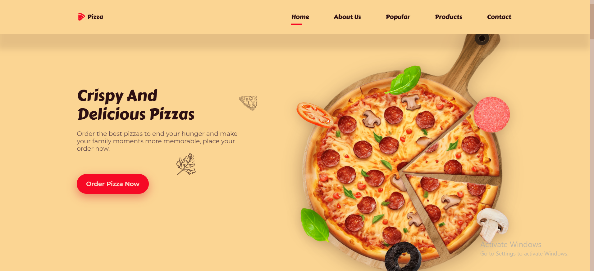

# Responsive Pizza Website

A simple responsive website for a pizza restaurant, built using HTML, CSS, and JavaScript.

## Features
- Responsive design for mobile and desktop
- Animated navigation
- Product cards for pizzas
- About us section
- Google Fonts integration

## Live Demo
[Click here to view website](https://ayaahmed222.github.io/pizza-website/)

## Screenshots

## Technologies Used
- HTML5
- CSS3
- JavaScript
- Git & GitHub

## Author
- **Aya Ahmed Shawky**
- [LinkedIn](https://www.linkedin.com/in/aya-ahmed-15b114247/)
- [GitHub](https://github.com/ayaahmed222)
